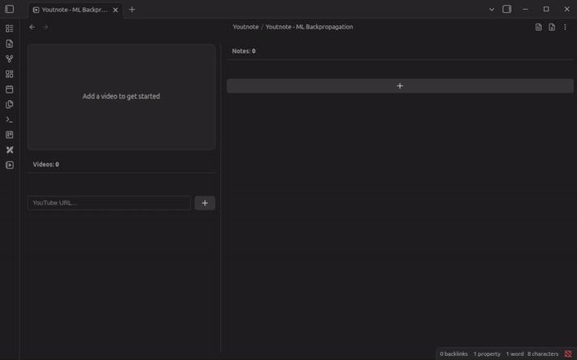

# Obsidian Youtnote Plugin

Embed multiple YouTube videos inside a single Obsidian note, take timestamped Markdown notes with live preview editing, and export everything back to clean Markdown. Youtnote keeps the video player and your research notes in lockstep so you never lose the context of what you were watching. Works on desktop and mobile.

> **Importnat:**
> You need Obsidian version `1.10.3` or later. If you use an older version, embedded YouTube videos will display "Error 153". Obsidian fixed this error in [version 1.10.3](https://obsidian.md/changelog/2025-11-11-desktop-v1.10.3/)

## Screenshots

#### Add videos by URL and add timestamped notes to them.

---

#### Resizable panes, sortable videos list, and more..

## Features
- **Multi-video timeline** – Track any number of YouTube videos inside the same file, reorder them with drag & drop, and jump between them instantly.
- **Timestamped note cards** – Click any note to seek the YouTube iframe to that second (with optional autoplay) or edit timestamps inline with validation.
- **Native Obsidian Live Preview editor** – The note editor embeds Obsidian's own CM6 Live Preview, so hotkeys, themes, and plugins work exactly as you expect.
- **Sticky player on phones** – Keep the video visible while scrolling through long note stacks thanks to the "pin on phone" option.
- **Duplicate timestamp merging** – Clean up messy sessions by merging duplicate timestamps into a single consolidated note.
- **One-click exports** – Export the active video or every video in the file to Markdown, optionally opening the generated file automatically.
- **Metadata fetch** – Paste any YouTube URL (Standard, Live, Shorts).
- **Note stats** – Optional per-video word & character counts.

## Installation
1. **Community Plugins (recommended once published)**
   - `Settings → Community Plugins → Browse → search for "Youtnote" → Install → Enable`.
2. **BRAT (during beta)**
   - Install the [BRAT plugin](https://obsidian.md/plugins?id=peppermint-brat).
   - Add this repo URL to BRAT and pull the latest build.
3. **Manual install**
   - Download the latest release from the GitHub Releases page.
   - Copy `main.js`, `manifest.json`, and `styles.css` into your vault's `.obsidian/plugins/obsidian-youtnote/` folder.
   - Reload Obsidian (`Ctrl/Cmd + R`) and enable the plugin.

## Usage
1. **Create a Youtnote file** via the ribbon icon or the `Create new Youtnote file` command. A file with `youtnote: true` frontmatter opens in the custom view.
2. **Add videos** with the YouTube URL field. Duplicates are prevented automatically.
3. **Select a video** to load it into the embedded iframe. Switching videos keeps the same player instance for smooth transitions.
4. **Add notes** using the `+` (or keyboard shortcut) – Youtnote auto-grabs the current playback time.
5. **Edit in Live Preview** by double-clicking a note. Use the configured newline shortcut (`Enter` or `Shift+Enter`) to save.
6. **Jump around** by clicking any timestamp – the player seeks (and optionally autoplays) to that moment.
7. **Export** single-video or full-note markdown via the header buttons.

## Settings Overview
All options live under `Settings → Plugin Options → Youtnote`:
- **Pin video on phone** – Keep the iframe sticky while scrolling on mobile.
- **Autoplay on note select** – Choose whether seeking should immediately play.
- **Single expand mode** – Only one note stays expanded at a time.
- **Persist expanded state** – Remember which notes were expanded when coming back to the video.
- **New line trigger** – Decide whether `Enter` or `Shift+Enter` inserts a newline vs. saves.
- **Open exported file** – Automatically open the generated Markdown file in a new tab.
- **Show note statistics** – Display total word/character counts in the note list header.

## Exporting Notes
- **Single video export**: each video gets its own Markdown file (with timestamps preserved) using the `Export` button beside the note counter.
- **Full file export**: consolidates every video + note into one Markdown file using the header action or view action.

## Support My Work
Youtnote is a passion project maintained in spare hours. If it helps your research or learning workflow, consider sponsoring future development:
- ❤️ [Ko-fi](https://ko-fi.com/khaldevmedia)
- 💼 [GitHub Sponsors](https://github.com/sponsors/khaldevmedia)

Every donation goes toward maintenance time, new features, and better documentation. Thank you!

---
Happy annotating! Open an issue or start a discussion if you have feature requests, questions, or feedback.
