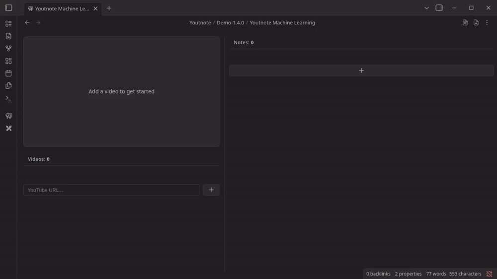
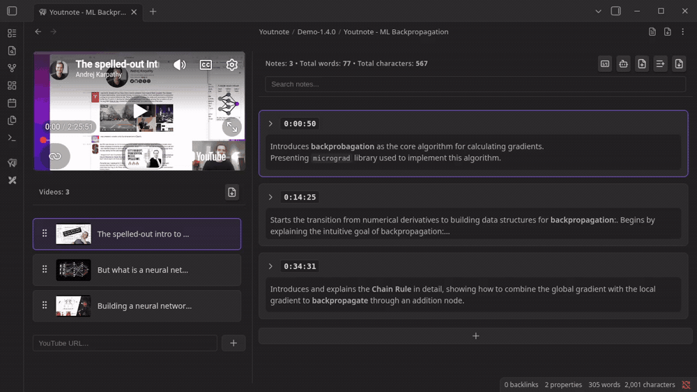

# Obsidian Youtnote Plugin

### Youtnote

---

Take timestamped Markdown notes with live preview editing across multiple embedded YouTube videos, all inside a single Obsidian note. Then, if you want, export everything back to clean Markdown. **Youtnote** keeps the video player and your research notes in lockstep so you never lose the context of what you were watching. Works on desktop and mobile.

## Screenshots

#### Add videos by URL and add timestamped notes to them.

---

#### Resizable panes, sortable videos list, and more..

## Known issue: Error 153 on iOS and iPadOS

> [!IMPORTANT]
> **Error 153 on iOS and iPadOS**
>
> The **Youtnote plugin** has a known issue on **iOS** and **iPadOS** that causes the YouTube player to fail to load and display **Error 153**.
>
> **Please** don't open a GitHub issue for this.
>
> The issue is **not a bug** in the plugin's code. The root cause is **missing or invalid HTTP `Referer` headers** in the YouTube API request that the plugin sends, due to a long-standing bug in WKWebView (the web renderer used by the Obsidian app on iOS and iPadOS).
>
> **Other plugins** that do not have this issue on iOS and iPadOS most likely rely on Obsidian's embedding workaround, which does not provide access via the YouTube API to video controls (play, pause, seek) or the current playback time, features Youtnote requires.
>
> For more details on this issue, please **[read here](https://github.com/khaldevmedia/obsidian-youtnote/blob/main/docs/error-153-ios.md)**.

## Features
- **Multi-video timeline**: Track any number of YouTube videos inside the same file, reorder them with drag & drop, and jump between them instantly.
- **Timestamped note cards**: Click any note to seek the YouTube iframe to that second (with optional autoplay) or edit timestamps inline with validation.
- **Native Obsidian Live Preview editor**: The note editor embeds Obsidian's own CM6 Live Preview, so hotkeys, themes, and plugins work exactly as you expect.
- **Sticky player on phones**: Keep the video visible while scrolling through long note stacks thanks to the "pin on phone" option.
- **Duplicate timestamp merging**: Clean up messy sessions by merging duplicate timestamps into a single consolidated note.
- **One-click exports**: Export the active video or every video in the file to Markdown, optionally opening the generated file automatically.
- **Metadata fetch**: Paste any YouTube URL (Standard, Live, Shorts).
- **Note stats**: Optional per-video word & character counts.
- **General notes**: Add one timestamp-less note per video for summaries, overviews, or context that doesn't belong to a specific moment. General notes sit at the top of the note list and are visually distinct.
- **Search notes**: Filter notes for the active video by text content or timestamp. The search bar lives in the notes pane header and clears automatically when switching videos or adding new notes.

## Installation
1. **Community Plugins (recommended once published)**
   - `Settings → Community Plugins → Browse → search for "Youtnote" → Install → Enable`.
2. **BRAT (during beta)**
   - Install the [BRAT plugin](https://community.obsidian.md/plugins/obsidian42-brat).
   - Add this repo URL to BRAT and pull the latest build.
3. **Manual install**
   - Download the latest release from the GitHub Releases page.
   - Copy `main.js`, `manifest.json`, and `styles.css` into your vault's `.obsidian/plugins/obsidian-youtnote/` folder.
   - Reload Obsidian (`Ctrl/Cmd + R`) and enable the plugin.

## Usage
1. **Create a Youtnote file** via the ribbon icon or the `Create new youtnote` command. A file with `youtnote: true` frontmatter opens in the custom view.
2. **Add videos** with the YouTube URL field. Duplicates are prevented automatically.
3. **Select a video** to load it into the embedded iframe. Switching videos keeps the same player instance for smooth transitions.
4. **Add notes** using the `+` (or keyboard shortcut): Youtnote auto-grabs the current playback time.
5. **Edit in Live Preview** by double-clicking a note. Use the configured newline shortcut (`Enter` or `Shift+Enter`) to save.
6. **Jump around** by clicking any timestamp: the player seeks (and optionally autoplays) to that moment.
7. **Add a general note** using the note icon in the notes header, perfect for video summaries or context without a timestamp. One per video.
8. **Search notes** using the search bar in the notes header to filter by text or timestamp (e.g. `1:23`). Only filters the active video's notes.
9. **Export** single-video or full-note markdown via the header buttons.

## Settings Overview
All options live under `Settings → Plugin Options → Youtnote`:
- **Pin video on phone**: Keep the iframe sticky while scrolling on mobile.
- **Autoplay on note select**: Choose whether seeking should immediately play.
- **Single expand mode**: Only one note stays expanded at a time.
- **Persist expanded state**: Remember which notes were expanded when coming back to the video.
- **New line trigger**: Decide whether `Enter` or `Shift+Enter` inserts a newline vs. saves.
- **Open exported file**: Automatically open the generated Markdown file in a new tab.
- **Show note statistics**: Display total word/character counts in the note list header.

## Exporting Notes
- **Single video export**: each video gets its own Markdown file (with timestamps preserved) using the `Export` button beside the note counter.
- **Full file export**: consolidates every video + note into one Markdown file using the header action or view action.
- General notes are exported with a `**General note:**` heading, placed at the top of their video's section.

## AI Agent Skill

Youtnote ships with a ready-to-use **agent skill** that lets an AI coding assistant (Claude Code, Cursor, OpenCode, Codex, Devin, Copilot, etc.) convert a timestamped YouTube transcript into a valid Youtnote file for you. Hand the agent a fetched transcript and the video URL, and it writes a `.youtnote.md` file with correct frontmatter, timestamped notes, and an optional general-note summary, ready to open in Obsidian.

The skill does **not** fetch transcripts itself; pair it with any transcript-fetching tool or skill you already use.

**Install:** copy the entire [`create-youtnote`](docs/skills/create-youtnote) folder (the one containing [`SKILL.md`](docs/skills/create-youtnote/SKILL.md)) into your agent's skills directory, e.g. `.claude/skills/`, `.cursor/skills/`, `.opencode/skills/`, `.devin/skills/`, or `.agents/skills/`. The result should look like `<skills-dir>/create-youtnote/SKILL.md`.

## Support My Work
Youtnote is a passion project maintained in spare hours. If it helps your research or learning workflow, consider sponsoring future development:
- ❤️ [Ko-fi](https://ko-fi.com/khaldevmedia)
- 💼 [GitHub Sponsors](https://github.com/sponsors/khaldevmedia)

Every donation goes toward maintenance time, new features, and better documentation. Thank you!

---
Happy annotating! Open an issue or start a discussion if you have feature requests, questions, or feedback.
